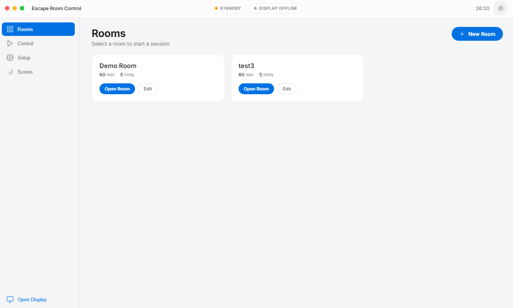
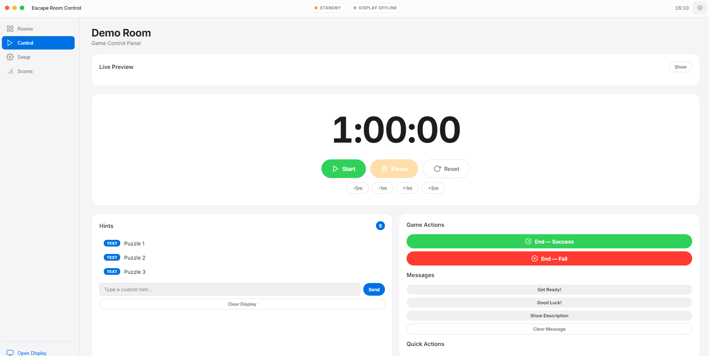
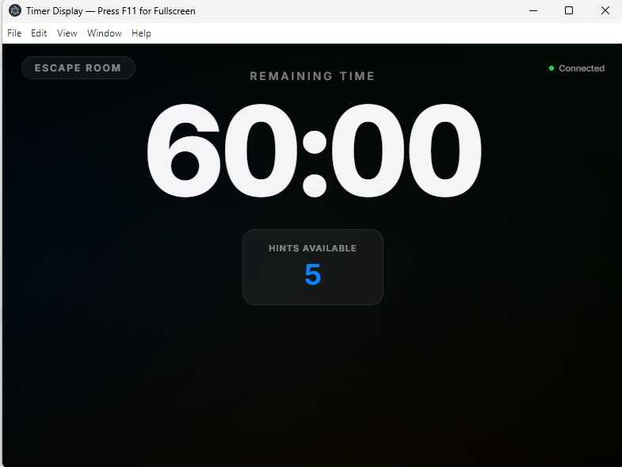

# Escape Room Timer & Hint Delivery System

A desktop application for managing escape room sessions. Game Masters use the dashboard to control a timer display shown on a second screen in the room.

Built with Electron, Express, and Socket.IO.

[](https://buymeacoffee.com/escaperoomsupplier)

## Screenshots

### Dashboard — Rooms


### Dashboard — Game Control


### Timer Display


## Features

- **Dashboard** — control panel for the Game Master (start/pause/reset timer, send hints, end game)
- **Timer Display** — fullscreen countdown shown on a second monitor in the room
- **Real-time sync** — dashboard and timer display communicate via WebSocket
- **Multiple rooms** — create and configure rooms with different durations, hints, and messages
- **Hint types** — text, audio, image, and video hints
- **Countdown modes** — standard (MM:SS), total seconds, percentage, count-up
- **Countdown effects** — 10 visual effects for the last 60 seconds (pulsate, shake, heartbeat, etc.)
- **Scheduled events** — trigger sounds, messages, or videos at specific minutes during the game
- **Quick actions** — configurable one-click buttons in the control panel
- **Puzzle controllers** — integrate Ultimate Universal Puzzle Controllers (UUPC) with real-time status and remote win/reset
- **Alert tones** — play sound effects on the timer display from the control panel
- **Background music** — play room theme music on the timer display
- **Custom backgrounds** — set images or videos as the timer display background
- **Display theme** — customize timer colors, fonts, and background per room
- **Scoreboard** — automatic game history with results, time, and hints used
- **Special messages** — Get Ready, Good Luck, and custom messages on the display
- **Live preview** — see the timer display in real-time from the dashboard
- **Light/Dark theme** — theme switcher in the dashboard

## Requirements

- [Node.js](https://nodejs.org/) 18 or later
- npm (comes with Node.js)

## Installation

```bash
git clone https://github.com/escaperoomsupplier/escaperoomtimersoftware.git
cd escaperoomtimersoftware
npm install
```

## Usage

```bash
npm start
```

This opens the Game Master dashboard. To show the timer on a second screen:

1. Click **Open Display** in the sidebar — this opens `http://localhost:3333/room` in a browser
2. Drag the browser window to your second monitor and press **F11** for fullscreen
3. Select a room from the dashboard and click **Open Room**
4. Use **Start / Pause / Reset** to control the timer
5. Click hints to send them to the room display
6. End the game with **End — Success** or **End — Fail**

### Development mode

Opens DevTools automatically:

```bash
npm run dev
```

## Room Configuration

Rooms are stored in `data/rooms/`. Each room has this structure:

```
data/rooms/My Room/
├── params.txt              # Duration, hint count, description
├── config.json             # Extended settings (theme, messages, countdown type, UUPC, events)
├── DefaultLanguage.sys     # Default language
├── scores.json             # Game history (auto-generated)
├── logo.png                # Room logo (optional)
├── hints/
│   └── English/
│       ├── Puzzle 1.txt    # Text hint (HTML content)
│       ├── Audio 1.mp3     # Audio hint (pair with .audioclue marker)
│       ├── Audio 1.audioclue
│       ├── Image 1.png     # Image hint (pair with .image marker)
│       ├── Image 1.image
│       ├── Video 1.mp4     # Video hint (pair with .videoclue marker)
│       └── Video 1.videoclue
├── main_theme/
│   └── theme.mp3           # Background music
└── sounds/                 # Room-specific sound effects
```

Global sound effects can be placed in `assets/sounds/`. Background images/videos go in `assets/backgrounds/`.

You can also create rooms from the dashboard UI via **New Room**.

## UUPC Integration

The software supports [Ultimate Universal Puzzle Controllers](https://wiki.escaperoomsupplier.com/wiki/Ultimate_Universal_Puzzle_Controller) for monitoring and controlling escape room puzzles.

Add controllers in Room Setup by entering their IP address. The control panel shows:

- **Real-time port status** — input and output states polled every 2 seconds
- **Machine state** — Armed, In Progress, Win, or Learning
- **Remote control** — Win, Arm (reset), or Start puzzles with one click

## Architecture

```
Electron Main Process
├── Express (port 3333) — serves timer display
├── Socket.IO — real-time events between dashboard and display
├── Room Manager — reads/writes room configs from data/rooms/
└── UUPC Proxy — forwards HTTP requests to puzzle controllers

Dashboard (Electron window) ──Socket.IO──▸ Timer Display (browser)
                            ──IPC/HTTP──▸ UUPC Controllers (LAN)
```

## Support

If you find this software useful, consider supporting the project:

[](https://buymeacoffee.com/escaperoomsupplier)

## License

MIT
